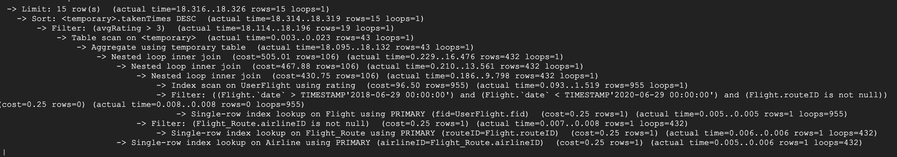

# Stage 3: Database Implementation and Indexing

## Database implementation

### Implement of main tables

Based on the UML diagram from stage 2, we implement our core application tables on the **Google Cloud Platform**. In general, our implementation includes **seven entity tables** (Airline, Airport, Flight, Flight_Route, SuccessLoginInfo, User, UserFlight), and **one many-to-many relationship** tables (UserFlight,User,SuccessLoginInfo).

Here is the screenshot of the connection:


### CREATE TABLE DDL command

We present the Data Definition Language (DDL) commands that we all used to create each of these tables in the database here.

`User`:

```sql
CREATE TABLE User(
	uid VARCHAR(255),
	FirstName VARCHAR(255),
	LastName VARCHAR(255),
	email VARCHAR(255) UNIQUE,
	password CHAR(64),
	PRIMARY KEY (uid)
);

```

`Airline`:

```sql
CREATE TABLE Airline (
	airlineID VARCHAR(255),
	airlineName VARCHAR(255),
	description VARCHAR(255),
	PRIMARY KEY (airlineID)
);
```

`Airport`:

```sql
CREATE TABLE Airport (
	airportID VARCHAR(255),
	airportName VARCHAR(255),
	PRIMARY KEY (airportID)
);

```

`Flight_Route`:

```sql
CREATE TABLE Flight_Route (
	routeID VARCHAR(255),
	airlineID VARCHAR(255),
	sourceID VARCHAR(255),
	destinationID VARCHAR(255),
	stops INT,
	PRIMARY KEY (routeID),
	FOREIGN KEY (airlineID) REFERENCES Airline(airlineID),
	FOREIGN KEY (sourceID) REFERENCES Airport(airportID),
	FOREIGN KEY (destinationID) REFERENCES Airport(airportID)
);

```


`Flight`:

```sql
CREATE TABLE Flight(
	fid VARCHAR(255),
	routeID VARCHAR(255),
	date DATETIME,
	equipment VARCHAR(255),
	PRIMARY KEY (fid),
	FOREIGN KEY (routeID) REFERENCES Flight_Route(routeID)
);

```

`UserFlight`:

```sql
CREATE TABLE UserFlight(
	uid VARCHAR(255),
	fid VARCHAR(255),
	rating DECIMAL,
	review VARCHAR(255),
	PRIMARY KEY (uid,fid),
	FOREIGN KEY (fid) REFERENCES Flight(fid),
    FOREIGN KEY (uid) REFERENCES User(uid)
);
```

`user`:

```sql
CREATE TABLE user(
	uname varchar(63),
	password varchar(63),
	email varchar(127),
	school_year int, 
	student_type varchar(15),
	department varchar(4),
	is_admin bit,
	primary key (uname)
);
```

`SuccessLoginInfo`:

```sql
CREATE TABLE SuccessLoginInfo (
	loginNo INT,
	uid VARCHAR(255),
	ipAddress VARCHAR(255),
	time DATETIME,
	PRIMARY KEY (loginNo, uid),
	FOREIGN KEY (uid) REFERENCES User(uid)
);
```


### Insert data to these tables

We got the data for our tables from [flight-route-database from kaggle](https://www.kaggle.com/open-flights/flight-route-database).Airport table contains more than 3000 rows. Besides, we generate 1000 rows of fake data for the `user` and corresponding `userFlight` tables.

#### the count for airport


#### the count for user


## Advanced Queries

#### two advanced SQL queries

We develop two advanced SQL queries related to the project. These advance queries are two important evaluation indicators in our final application.

the first advanced SQL queries is to calculate `airline name and count of the taken times and the avgRating`

```sql
SELECT equipment, avg(rating) as avgRating
FROM UserFlight natural join Flight
WHERE date > '2019-01-01 00:00:00'
GROUP BY equipment
ORDER BY avgRating DESC
LIMIT 15;
```

Here is the screenshot of the top 15 rows of the first query result:


the second advanced SQL queries is to calculate `route ID and the count of flight date which source airport name begin with A`


```sql
Select fr.routeID, Count(f.date) as routeFreq
FROM Flight f natural join Flight_Route fr natural join Airline join Airport s on fr.sourceID = s.airportID join Airport e on fr.destinationID = e.airportID
WHERE s.airportName like 'A%'
Group By fr.routeID
Order By routeFreq DESC
limit 15;
```


Here is the screenshot of the top 15 rows of the second query result:


## Indexing analysis

### Measure our advanced query performance

We use the EXPLAIN ANALYZE command to measure our advanced query performance. Here is the output of EXPLAIN ANALYZE command for our 1st advanced query:


### QUERY1

```sql
EXPLAIN ANALYZE
SELECT equipment, avg(rating) as avgRating
FROM UserFlight natural join Flight
WHERE date > '2019-01-01 00:00:00'
GROUP BY equipment
ORDER BY avgRating DESC
LIMIT 15;
```
- OUTPUT-DEFAULT:


```sql
create index idx1 on Flight(equipment)
```
- OUTPUT1:


- Explain

We thought by creating an index for equipment would speed up the aggregation process. However, it seem the query optimizer didn't use our index because the aggregation using temp table is already pretty fast (there is only 43 rows)


```sql
create index date on Flight(date)

```

- OUTPUT2:


- Explain

We thought by creating an index for date because it will speed up the filter process. Similarly, the filter process is already pretty fast; therefore, our index is not used.

```sql
create index rating on UserFlight(rating)
```


- OUTPUT3:



- Explain

We identified the bottleneck for this query are the joins. However, since they all used nested loop join with inner index lookup, which is pretty optimized given the primary index is used. Therefore, adding rating index will not surprisingly affect the speed.


### QUERY2

```sql
EXPLAIN ANALYZE
Select fr.routeID, Count(f.date) as routeFreq
FROM Flight f natural join Flight_Route fr natural join Airline join Airport s on fr.sourceID = s.airportID join Airport e on fr.destinationID = e.airportID
WHERE s.airportName like 'A%'
Group By fr.routeID
Order By routeFreq DESC
limit 15;
```

- OUTPUT-DEFAULT:


```sql
create index idx1 on Airport(airportName);
```
- OUTPUT-1:


- Explain

  Compare with the ANALYZE RESULT before and after built idx1 on query2, the actual time decreased from 23...23 to 15...15. The idx1 is to build an index on Airport.airportName, and a where clause in query2 search all airportName which start as an 'A'. With an index on airportName, the search process accelerates. We observed the results of the ANALYZE of query2 and find that one nested loop inner join found rows from 547 to 34, it is corresponding with the WHERE clause and the query can find specific airportName by index.


```sql
create index idx2 on Flight_Route(sourceID,destinationID)
```
- OUTPUT-2:

- Explain
  using this idx2 will not affct the index time because our query use sourceID and destination ID. Both of these ID are the Foreign key of table Flight_Route. So before we add this index, this query has already have index.

```sql
create index idx3 on Flight_Route(stops);
```
- OUTPUT-3:


- Explain
  using this idx3 will not affct the index time because our query do not use the column stop in our query.


## The Indexing design we select is as follows:

```sql
-- this is derive form SQL2
create index idx2 on Airport(airportName);
```

No more index derived from SQL1 because SQL1 is already faster compared with built indexes.


