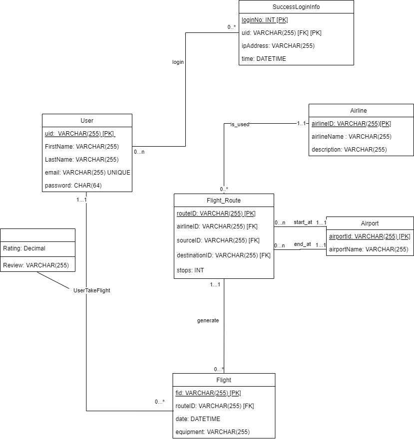

# UML Diagram




### Assumptions

- We assume that email should be unique globally for each registered user and can be linked to exactly one user.
- We assume that each user needs an email and a password to be registered in the system.
- We assume that each user can log in multiple times to their accounts and each success login record only associates to one user.
- We assume that each flight is associated with exactly one flight route and a flight route can have multiple flights (each day for instance).
- We assume each flight route belongs to exactly one airline company and each airline company can have multiple routes.
- We assume each flight route has exactly one start city and end city. Each city can have multiple flight routes starting or ending from it.
- We assume each user can take multiple flights and each flight has been taken by multiple users.


### Relationship Descriptions

|Relation|Cardinality|
|---|---|
|Email<->User|one to one|
|User<->SuccessLoginInfo|many to many|
|User<->UserFlight|many to many|
|UserFlight<->Flight|many to one|
|Flight<->Flight_Route|many to one|
|Flight_Route<->Airline|many to one|
|Flight_Route<->City|many to one|


### Logical Design (Relational Schema)

```sql
User(uid VARCHAR(255) [PK],	FirstName VARCHAR(255),	LastName VARCHAR(255),	password CHAR(64));
Airline (airlineID VARCHAR(255) [PK],	airlineName VARCHAR(255),	description VARCHAR(255));
City (cityId VARCHAR(255) [PK],	cityName VARCHAR(255));
Flight_Route (routeID VARCHAR(255) [PK],	airlineID VARCHAR(255)[FK to Airline.airlineID],	sourceID VARCHAR(255) [FK to City.sourceID],	destinationID VARCHAR(255)[FK to City.cityId],	stops INT,);
Flight(fid VARCHAR(255) [PK],	routeID VARCHAR(255) [FK to Flight_Route.routeID],	date DATETIME,	equipment VARCHAR(255),);
UserFlight(uid VARCHAR(255) [PK][FK to User.uid],	fid VARCHAR(255) [PK][FK to Flight.fid],	rating DECIMAL,	review VARCHAR(255));
SuccessLoginInfo (loginNo: INT [PK],uid: VARCHAR(255) [FK to User.uid],ipAddress VARCHAR(255),time DATETIME);
Email(uid VARCHAR(255) [PK] [FK to User.uid],email VARCHAR(255));
```
