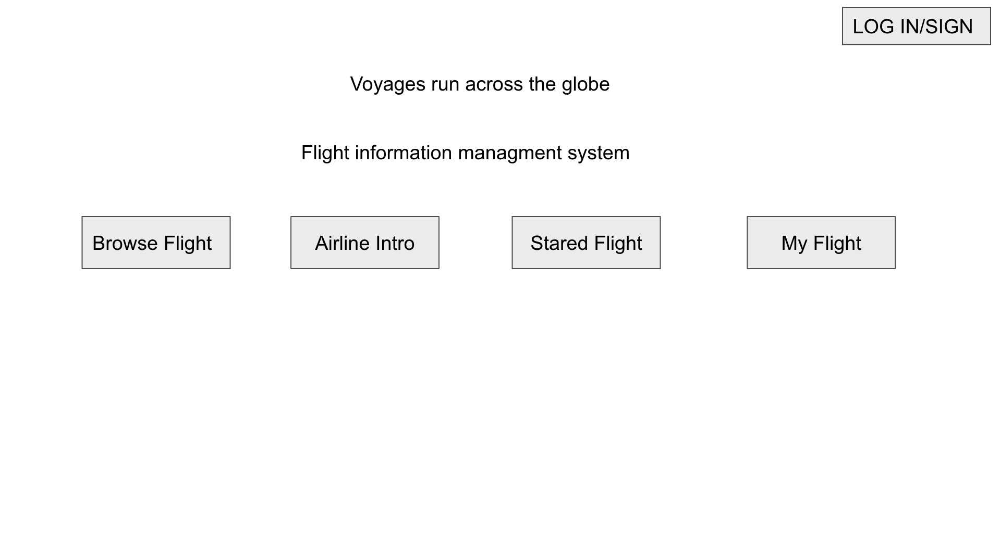
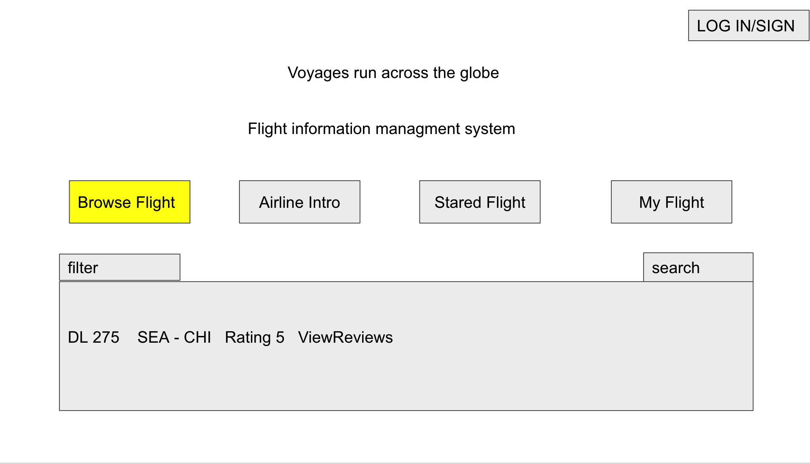
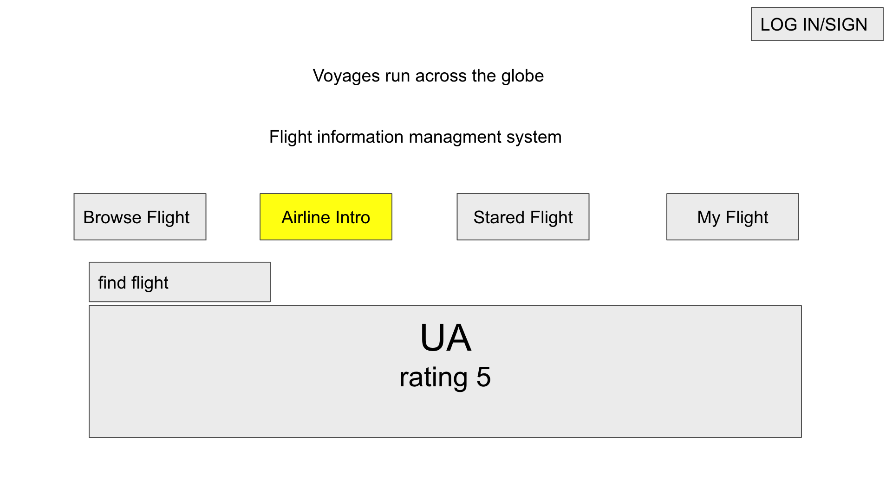
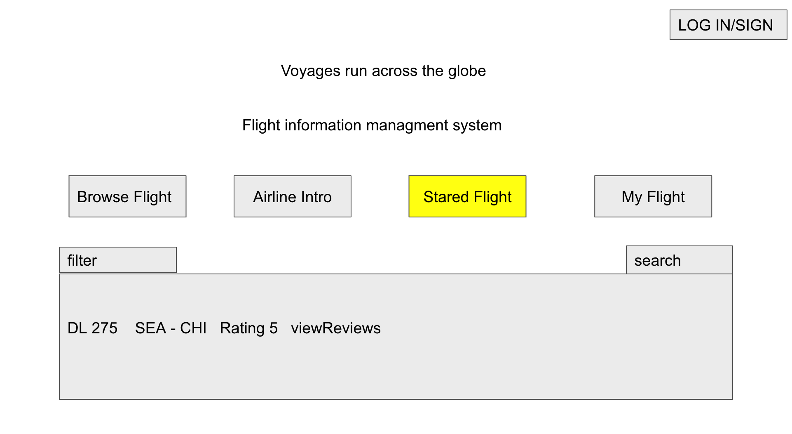
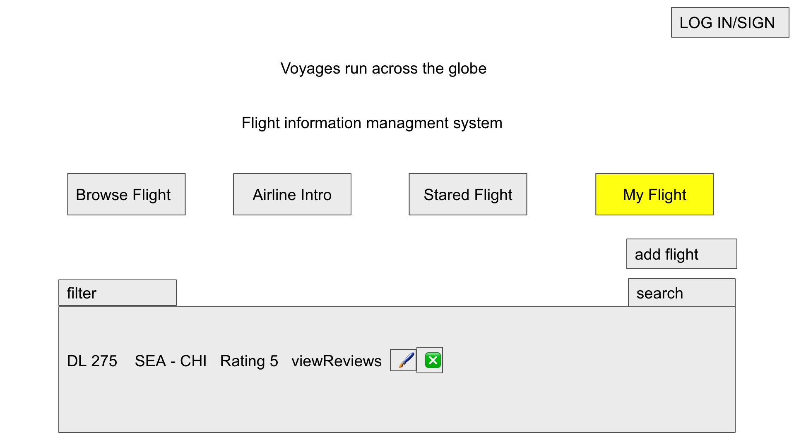

# **Voyages run across the globe**

> Summary: Our project is to implement a system that helps users to manage flight information. Nowadays, airlines have their own information systems, and a single user needs to log into multiple systems to manage their flight information, which is very troublesome.
>
> 
>
> Therefore we want to implement a system that helps users to view flight information of each airline, manage their historical voyages, flight reviews, and count historical data. This will help users to make more informed flight selection strategies in the future.

## Description

We intend to make a comprehensive search system for flight route information. Users can use this system to look up all possible flight routes of different airlines from A to B and to query the user's historical flight mileage.

We want a system that makes it easy for users to view historical trips and possible future trips in a comprehensive way. Currently, each airline's system is independent and users have no way to analyze their own past flights and manage their mileage.

We also allow users to write reviews and add ratings to individual flights or a specific airline so people can choose a flight based on past user experience.

## Usefulness

Similar website: Trip it/ app in the air/ checkMyTrip/ Notion.

Trip it/ trip in the air/checkMyTrip mainly focus on collecting/ formatting users’ flight and booking flights. We extend their feature by managing mileages/ writing reviews about airlines and specific flights.

The notion is a project management/ task tracking software. The database feature allows user to track their past trips. However, there is no way for users to see all available flights & plan their future trips. This app also lacks the social aspect and users will not be able to see others' reviews or post their own reviews of a flight.

## Realness

This data who use from Kaggle (https://www.kaggle.com/open-flights/flight-route-database) which has the data of flight-route. We still need datasets containing users and specific flight data which include uid and date. We can use the flight route data to generate the user dataset and flight dataset. We also need some review data and rating data, which we can manually input some dummy data for now.

## Functionality (2%)

1. Stored Data

   The system includes these data tables:

   User: uid, fname, lname (manual input)

   Flight Route: routeid, airlineID, sourceID, destinationID, stops (from kaggle dataset)

   Flight: fid, routeid, date, equipment (from Kaggle dataset)

   UserFlight: uid, fid, rating, review (manual input)

   City: cityID, cityName (from Kaggle dataset)

   Airline: airlineName, airlineID, description (from Kaggle dataset)

2. Basic Functions

  - CRUD:

  ​	Create: loading data to database, user flight information

  ​	Read: flight route information, user flight information, airline information, user star flight route, filtered flight information

  ​	Update: user flight information, airline review

  ​	Delete: user flight information, airline review

  - Search by: Flight Name, Flight Id, Flight Source, ID Flight destination ID 

3. Creative Component

   We believe a flight preview feature will significantly improve our user experience and set us apart even more from other similar apps. The feature can be visualized with a map.

## Low Fidelity UI mockup

What do you imagine your final application’s interface might look like? A PowerPoint slide or a pencil sketch on a piece of paper works.
 
 
 
 
 

## Project work distribution

Who would be responsible for each of the tasks or subtasks? List of the person responsible for which exact functionalities in section f. Explain how backend systems will be distributed across members. Be as specific as possible as this could be part of the final peer evaluation metrics.

All members will participate in designing the database and collecting data. We will then distribute the workload based on each entity we identified.

user-related table/query (User, UserFlight, Stared): Chang Xu, Taihao Liu

airline-related table/query (Flight Route, Flight, City, Airline): Xinyuan Chen, Guangyuan Liu

